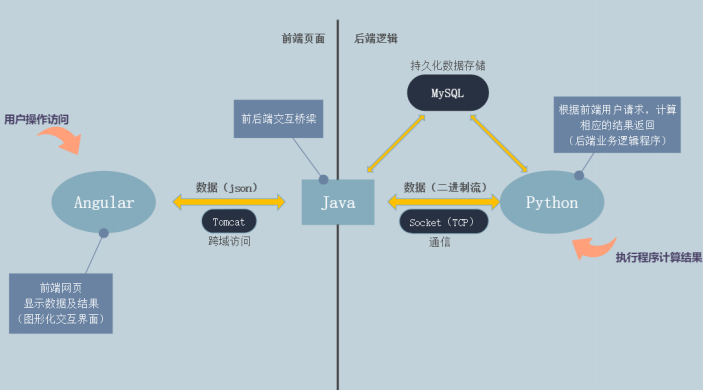
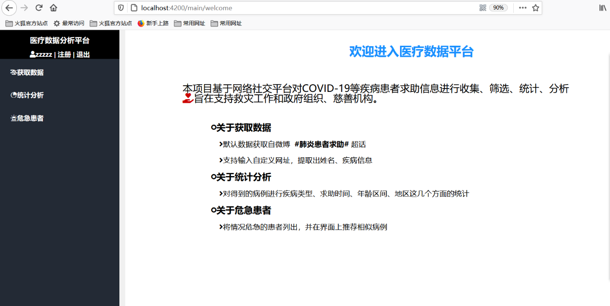
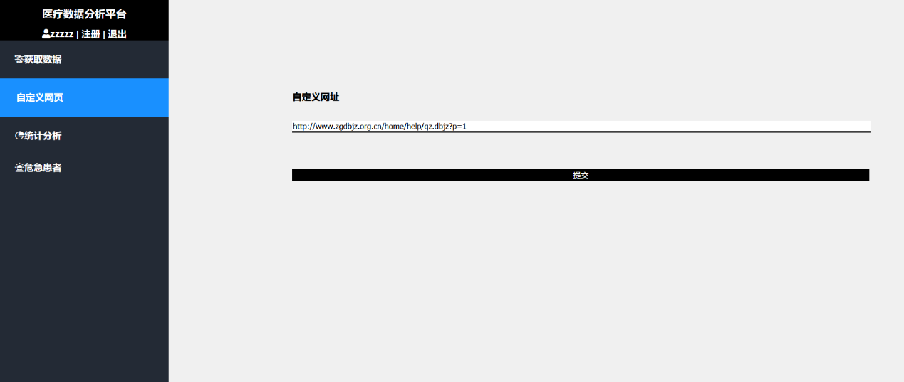
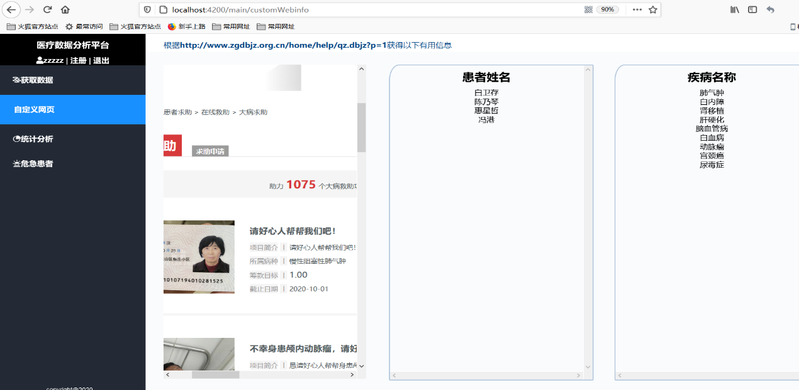
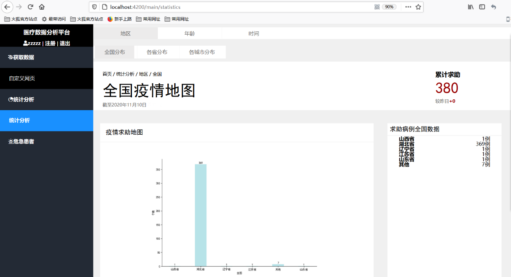
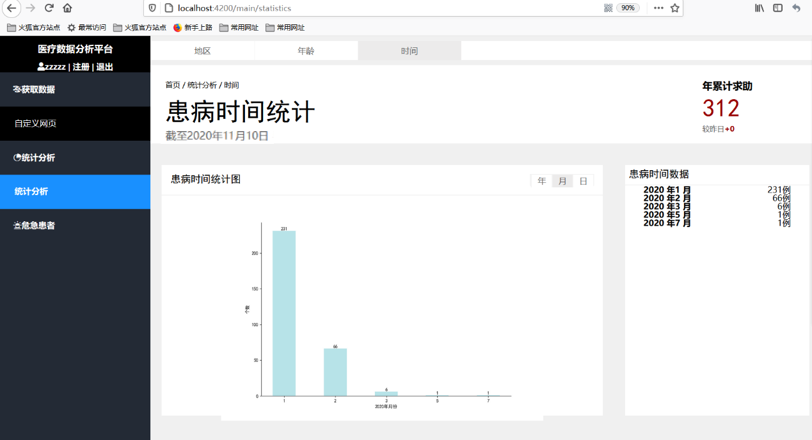
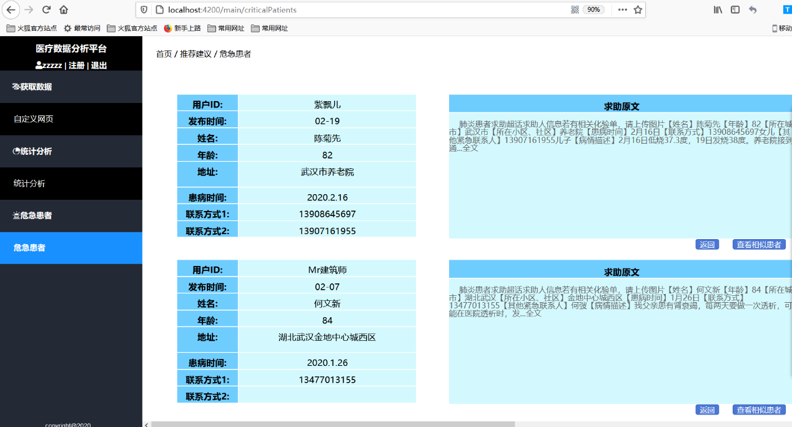

# 基于爬虫的社交网络求助信息收集平台项目报告

| 成员 | 学号 |
| :----: | :----: |
| 陈映筱（组长） | 87180217 |
| 王超玉（组员） | 55181006 |
| 薛心媛（组员） | 09181102 |
| 王阳洋（组员） | 15180405 |

 

# 一 项目简介：

疫情期间，各大公共社交平台如微博、贴吧、论坛、Twitter 等逐渐成为人们热议新冠肺炎的场所，因此，本组专注于网络平台求助信息，对信息进行分析，利用网络媒体实时性的特点，提供真实具有时效性的信息，为全球渡过难关献一份力。 

本项目实现基于网络社交平台，对COVID-19等疾病患者求助信息，利用Python 获取信息，进行收集、筛选、统计、分析，以Java 作为连接前后端服务的桥梁，最终在Angular框架下，在网页中显示统计分析结果，提出相应建议，提高交互性，最终达到帮助控制疫情、精确援助的目的。 

首先，本项目对社交平台患者求助信息进行收集，并对病例加以筛选，考察病例真实性，选出真实可靠的病例信息。 

其次，对得到的病例进行求助时间、年龄区间、地区这几个方面的统计，立足于这些角度进行分析,得到这些方面的数量以及占比情况。 

最后，通过对求助患者所在地区的分析情况，针对不同地区，给出风险评级和医疗建议。 

不仅如此，本项目还将情况危急的患者列出，并在界面上推荐相似病例，使其能及时得到帮助。 

分析完毕后，将以上得到的分析结果通过网页形式展示。

 

 

# 二 成员分工：

陈映筱（40%）：设计前端页面布局获取自定页网址；编写了获取微博#肺炎患者求助#超话爬取数据的超话的Python代码；编写了可通用的网页数据获取Python代码。对爬虫得到的原始半结构化或非结构化叙述性文本进行处理，提取出关键信息，使之结构化；处理Python程序和Java程序之间的信息互相传送的问题，编写业务逻辑代码，整合业务逻辑；调试配置云服务器和云数据库，并将网站部署上云，将项目的所有前端页面、样式、Js代码等整合到angular框架中。

王超玉（20%）：设计前端页面布局；在后端中实现Angular和java之间的跨域访问，编写了相关Servlet程序以处理前端请求；同时实现了java和mysql数据库的访问；编写得到危急患者和相似病例的函数。

薛心媛（20%）：设计前端页面布局；负责对病例进行统计分析并画图显示分析结果的部分，使用Python程序将数据从数据库中提取并进行年龄段、地区和患病时间这几个方面的统计与分析结果，并将分析结果通过Python程序画图显示出来；

王阳洋（20%）：设计前端页面框架：设计前端登录、注册、欢迎页面及侧边栏；爬虫获取医疗名词，将其整理成词库，优化分词功能。 

 

 

# 三 总体架构:

 

# 四 项目技术细节:

## 1.前端

基于 angular 的框架利用框架中组件、服务、模块、路由。首先设计静态页面布局结构在html文件中，之后再组件对应的less 文件中进行样式设计。为保证数据能够从数据库和程序中动态获取，在前端展示的特定位置的属性数据进行了绑定。利用了双向数据绑定俩获取表单中的内容。整个网页的呈现是单页面应用的形式，在成功登录之后，通过路由动态挂载页面。为实现内容的封装，将功能相关性高的组件封装成一个模块，实现了懒加载，提高整个网页的运行刷新速度。将登录后的页面封装在一个组件中，最左侧的导航栏放在一个main组件，之后根据左侧导航栏的功能，创建了相应的组件。

## 2.XML的应用

XML作为Java Web项目的重要配置文件：

（1）定义Web 应用名称，提供GUI工具用来标记Web应用的一个名称。

（2）配置Web应用首页，配置文件欢迎页。

（3）配置和管理Servlet，声明Servlet的名称、类名称以及所对应的URL等子元素。

（4）配置错误页面，通过错误码来配置error-page。当系统发生错误时，跳转到特定错误处理页面。

## 3.登录页面

创建了login组件，设计了相应的布局及样式，在html中获取用户名和密码进行双向数据绑定；给登录按钮绑定单击事件函数，该函数卸载组件的ts文件中，主要功能是进行数据库核对前的用户名、密码格式验证，保证用户名和密码是合法格式，并通过数据绑定在前端显示用户提示信息。

## 4.注册页面

创建了regist组件，类似于登录页面的设计实现，不同的是增加了验证码，为防止用户刷新后请求多次转发。验证码的实现是通过将包含大小写的所有英文字母，在ts文件中随机生成四位显示在前端。并给验证码的显示区域绑定单击事件，该事件可以再重新随机生成四位显示在前端，实现验证码的刷新。

## 5.自定义页面

首先定义了一个get_web_info组件，在里面双向数据绑定获取用户传入的网址，给按钮绑定单击事件，该事件函数，将获取的网址放到会话域中，通过路由转发到获取数据的组件，展示数据。

## 6.自定义网页数据展示页面

在该页面中，从会话域中获取数据，并在没有 http:\/\/的网址前加上该内容，在该页面的iframe中展示该页面，并在右侧依次展示从后端获取来的姓名疾病信息。

## 7.统计分析页面、危急患者页面

设计了相应的布局和样式，通过定义js函数实现不同栏目和内容的选择，使鼠标点击某一内容时在同一页面实现变换。

## 8.后端数据获取

### （1）获取微博#肺炎求助患者#超话中的数据

利用selenium模拟控制浏览器，数据获取是基于微博移动端的网页，数据加载的形式是滚动条下拉刷新的，先使用xpath文本定位获取总共的评论数。该网页每展示20个评论之后会刷新出新的数据，模拟浏览器执行下拉动作，直至刷新出所有数据然后利用网页结构，使用xpath文本定位出一条帖子，获取所有有用信息。当存在有全文展示不全的情况，根据该网页再爬取所有有用的信息。

### （2）获取自定义网页的数据

同样利用 selenium 模拟控制浏览器。为保证通用性，在获取之前先进行模拟浏览器下拉动作，尽可能的使当前网页呈现较全面的数据之后，在使用xpath文本定位获取body中的所有文本。 

## 9.数据结构化

### （1）微博中数据的处理

将遍历爬虫得到的原始微博信息，逐条处理。由于微博的求助信息大多为半结构化文本，有特定的格式，因此设置了与微博信息结构相符的正则表达式，准确提取出联系方式，并将其余文本信息初步结构化。后使用Python中的中文文本自然语言处理库Hanlp，在初步结构化的基础上进行分词分类，识别出文本中的人名，地址，患病时间等信息，再使用可将地址中省，市，区信息提取出来的自然语言处理库cpca将地址信息结构化。处理完毕后，将处理的到的信息存入数据库，便于接下来的统计分析。自定义网站功能数据处理将当前网页上显示的全部信息爬取下来后，使用正则表达式去除HTML语句内容。在此基础上，使用Hanlp文本分类，属性标注的功能，提取出文本中的人名和疾病名信息。因为Hanlp词库中关于疾病名的信息不够丰富，通过爬虫爬取医疗相关网页，处理后得到疾病名称词库，放入Hanlp的词库中，提高了对疾病名称的识别精度。

### （2）自定义网站功能数据处理

将当前网页上显示的全部信息爬取下来后，使用正则表达式去除 HTML语句内容。在此基础上，使用Hanlp文本分类，属性标注的功能，提取出文本中的人名和疾病名信息。因为Hanlp词库中关于疾病名的信息不够丰富，通过爬虫爬取医疗相关网页，处理后得到疾病名称词库，放入Hanlp的词库中，提高了对疾病名称的识别精度。 

## 10.统计分析功能

这一部分，功能的实现是通过编写python函数。统计分析分为对数据进行年龄段、时间和地区上的分析，时间又分为年、月、日，地区又分为国家、省、市。这7个方面分别定义7个不同的python 文件。每个文件中均包含这些函数：计算总患病人数，计算相较昨日增加的患病人数、分析得到的分类结果、画图显示。计算总患病人数是在当前不同文件的限制条件下计算数据库中存储的个数。计算较昨日增加个数是得到系统时间，计算今日所有患病人数。分类结果是根据所要得到的结果进行数据库的查询，例如得到国家的分析结果即计算数据库中各省患病的人数，并将得到的结果存入列表中。画图是将分析后的结果导入，进行柱状图的绘制。

## 11.危急患者功能与相似病例功能

这一部分的功能通过编写 python 函数实现。通过函数查询数据库，得到危急患者的全部信息并储存。得到某一条危急患者的相似病例时，该函数参数为储存所有危急患者的列表以及这一条危急患者在列表中所在的下标，根据地区相同以及年龄段在70-90之间查询数据库，得到相似病例，若无满足该情况的病例则查询城市相同以及年龄段在70-90之间的病例，得到相似病例并储存至列表中。

## 12.Java与数据库的交互

先配置JDBC.Property文件，配置好云端数据库访问地址，用户名及密码。使用druid的jar包和mysql.connect的jar包，基于javaweb工程的三层架构Dao层，Service层，Web层。在Dao层实现具体数据库操作语句的相关函数。

## 13.Java中处理 angular的请求

在处理登录注册请求是，基于javaweb工程的三层架构，Dao层，Service层，Web层，封装了相应的代码。在Web层封装了 BaseServlet类，使继承该类的Servlet在具体调用特定功能时只需保证action等于该函数名即可调用。并且为了提高复用性，封装了工具类可读取json字符串，并使用谷歌的gson的jar包来将类转化为json字符串。 

## 14.Angular和Java的Servlet交互

### （1）Angular数据传递给Java

跨域访问配置 poxy.config.json 文件统一设置跨域访问地址公共部分，导入HttpClient、HttpHeaders、Observable，设置请求头，调用 HttpClient 类型变量中的post函数，以json字符串的形式传递给java。 

### （2）Java数据传给Angular

在对应的Servlet程序中通过reponse将数据以json字符串的形式传给Angular中利用subscribe来接收json字符串信息。

## 15.Java服务器与 Python 服务程序的通信

### （1）Java与Python的交互

考虑到 Java 的稳定性，跨平台特性和丰富的开发资源，我们选用 Java语言编写的工程来做服务器；因为网页功能中包括爬虫和自然语言处理，所以选用在这两个方面资源丰富的 Python作为辅助服务程序的编写语言。 

为方便演示和使用，Java 服务端和 Python 服务程序均已在云服务器中部署好，两者之间使用 socket进行通信，使用TCP协议。 

在Python程序和Java工程的通信中，采用客户机-服务器模式，Java服务器作为客户端，向 Python 服务程序发送指令，并得到相应的数据；Python 服务程序作为服务端，不间断运行，等待接收 Java发来的指令，解析指令，运行相关功能，返回对应的Json类型字符串或文件，将其发送给Java服务器。

### （2）指令收发

为解决一次通信过程中多次发送数据造成的粘包问题，将每次发送信息重新编码，在信息头部增加四个字节作为标示位，储存接下来要发送信息的长度；信息的接受者每次接收信息时，都需要先读取前四个字节，得到信息长度，按此长度读取信息。

### （3）Json数据格式字符串的收发

Python程序作为服务端，接收命令后向 Java 工程发送数据。考虑到发送和接收数据存在时间差，部分字符串长度很长，可能存在丢包情况，这里采用以Java端在接收全部数据后主动断开socket连接的方式作为通信结束的信号并在Java端使用byte数组完整保存数据内容，在结束通信后统一转码字符串。

### （4）文件的收发

Python程序作为服务端，接收命令后向Java工程发送二进制流数据，先发送文件名和文件长度信息，后发送文件数据。Python以二进制的方式读取待传送文件，一次读取缓冲区大小（1024）的数据，分批发送给Java工程。这里采用Python程序传送完毕后主动关闭socket连接作为通信结束的信号；Java接收程序以二进制流的方式读去 Python程序发送的内容，并直接将流写入文件，完成文件的保存。

# 五 成果展示

 

本网站的使用指南，帮助用户快速上手。

 

 

获取本网站的主要逻辑功能是基于微博#肺炎患者求助超话#中的数据，但为保证通用性和广泛性，实现了自定义网页查询。用户输入网址信息，可筛选出网页中的患者姓名和疾病名称，便于用户使用，且在左侧显示该网页，方便浏览比对。

 

点击侧边栏中统计分析这一条，点击地区以及全国，系统自动得到当前时间并显示，后台计算全国累计求助个数以及较昨日增加的求助患者个数，并自动生成全国各省份求助病例的个数显示在求助病例全国数据中，后台通过求助病例全国的数据自动生成柱状图进行显示。

 

点击月，系统计算2020年以来所有月份的累计求助个数以及较昨日增加个数并显示，接着系统以月为单位计算每月各自的求助病例个数且根据这些信息画出柱状图，显示在界面中。

 

将年龄在80以上的患者为危急患者，可显示出所有符合该标准的患者信息。并且根据地区相同以及年龄段在70-90之间查询数据库，得到相似病例，若无满足该情况的病例则查询城市相同以及年龄段在70-90之间的病例，之后刷新当前页面，显示相似病例。