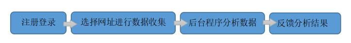
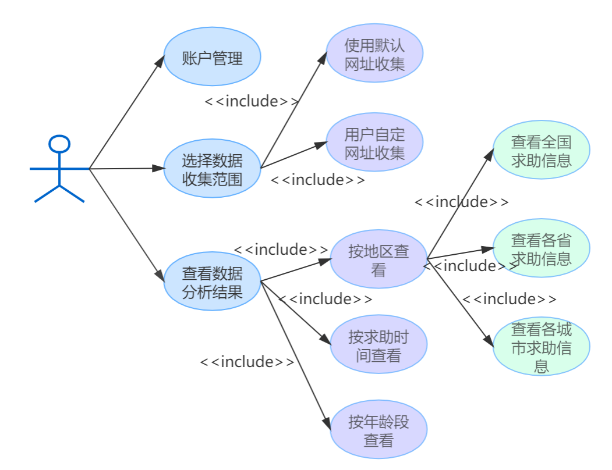
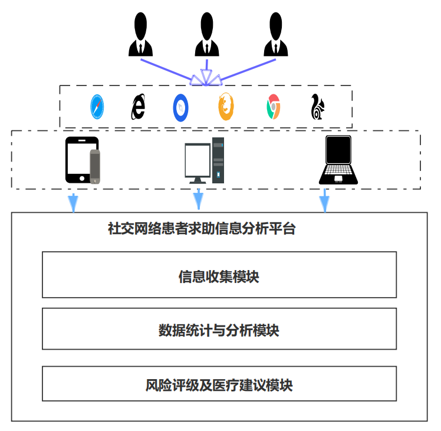

# 基于爬虫的社交网络求助信息收集平台项目需求分析与总体设计

## 一、项目初衷：
​	疫情期间，各大公共社交平台如微博、贴吧、论坛、Twitter 等逐渐成为人们热议新冠肺炎的场所。由于疫情来得迅猛，对医院的收容能力提出巨大的挑战，但巨大的体量使得仍有部分人群不能及时得到帮助，此时，通过社交网络平台发布求助信息便是这部分人群的一个不错的选择。因此，本组专注于网络平台求助信息，对信息进行分析，利用网络媒体实时性的特点，提供真实具有时效性的信息，为全球渡过难关献一份力。 

​	本项目致力于实现基于网络社交平台，对COVID-19等疾病患者求助信息的收集。拟用Python 获取信息，进行收集、筛选、统计、分析，以 Java 作为连接前后端服务的桥梁，利用前端框架（如Vue, Angular），在网页中显示统计分析结果，提出相应建议，提高交互性，最终达到帮助控制疫情、精确援助的目的。
## 二、需求分析

本项目的工作流程为：

​	由此可见用户可以：

  - 注册账号或登录账号
  - 利用默认选项进行信息收集
  - 自定义网址进行信息收集
  - 查看数据解析结果

  由此分析其用例图如下：

## 三、系统体系结构设计

### 3.1系统总体架构

​	其中信息收集模块对社交平台患者求助信息进行收集，并对病例加以筛选，考察病例真实性，选出真实可靠的病例信息。

​	数据局统计与分析模块对得到的病例进行求助时间、年龄区间、地区这几个方面的统计，立足于这些角度进行分析，得到这些方面的数量以及占比情况。  

​	风险评级及医疗建议模块通过对求助患者所在地区的分析情况，针对不同地区，给出风险评级和医疗建议

### 3.2层次化体系结构

​	使用层次化体系结构，更加清晰地展示系统各部分职责及其层与层之间的交互，便于理解系统、提高系统的模块性，并在一定程度上提高组员间交流与编码的效率。

## 四、初步任务分工

**前端设计：** 薛心媛，王阳洋

**开发人员：** 

前后端交互：陈映筱，王超玉

数据收集与分析：陈映筱，王超玉

**测试与维护：**陈映筱，薛心媛

（详细成员分工见设计报告）